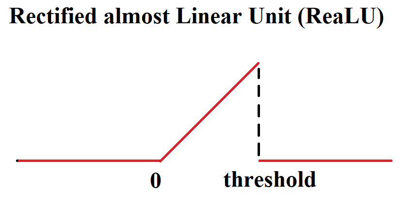
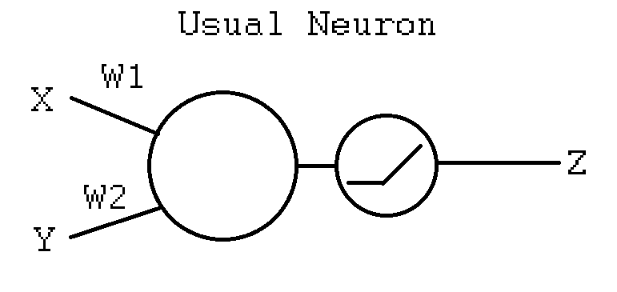
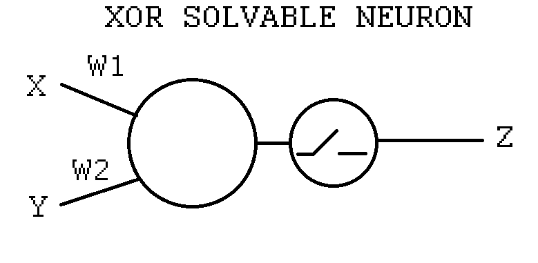

### XOR solvable activation function helps DNNs
Author: Sungguk Cha
eMail : navinad@naver.com

### Introduction

 In 1950s, Frank Rosenblatt proposed PERCEPTRON which is the fundamental element of modern machine learning.

 In 1960s, Marvin Minsky proved "SINGLE PERCEPTRON CANNOT SOLVE XOR PROBLEM."

 In 1980s, McClelland et. al. suggests multi-layer perceptron and backporpagation in <Parallel Distributed Processing>.

 Based on such background, our machine learning, especially deep learning, adopts the multi-layer perceptron model.

 Jan 3, 2020, <Dendritic action potentials and computation in human layer 2/3 cortical neurons> says single human neuron can solve XOR problem. 
 ```Shell
 In contrast to typical all-or-none action potentials, dCaAPs were graded; their amplitudes were maximal for threshold-level stimuli but dampened for stronger stimuli.
 ```

 I designed very similar activation function which can solve XOR problem with SINGLE PERCEPTRON. Stepping further, I was curious if such single XOR solvable perceptron helps modern DNNs. I propose Rectified almost Linear Unit (ReaLU).
 

 
 This repository contains single-neuron-XOR-solvable activation function experiment (see 'xor activation.ipynb'). In add to it, I implemented ReaLU + ResNet.

### Experiment

 
 
 It is the original PERCEPTRON model, which uses any activation functions (ReLU in the figure). 
 
 
 
 Though Minsky said "single perceptron model cannot solve XOR problem" in 1950s, my experiment shows that even the single original PERCEPTRON model with ReaLU can solve XOR problem (see 'xor activation.ipynb').
 
### ReaLU applied ResNet

 My question arises here. If one neuron can solve XOR, while the others cannot, then can we say "the neuron that solves XOR is better?" Stepping further, I wonder "can XOR solvable neuron perform better than the conventional ones?" In that sense, I implemented ReaLU applied ResNet. 
 
 Lets ask, experiment and solve my question together!

### References

Dendritic action potentials and computation in human layer 2/3 cortical neurons: https://science.sciencemag.org/content/367/6473/83?fbclid=IwAR27c0LVs3mb0saP5I6zwPU5Fs3ckfeiMmzjuGLgMpMjJM-Mmj1ZBFvCOK0
